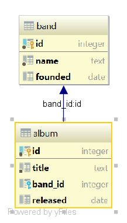

# Лабораторная работа №1 "Доступ к разнородным БД на основе онтологий"

## Задание
[Лабораторная работа №1 "Доступ к разнородным БД на основе онтологий](https://github.com/ailabitmo/semweb-course/blob/master/lab-1/README.md)

## Разработка

Предметная область представлена двумя базами данных, хранящими информацию о музыкальных группах, их альбомах и композициях.

#### Схемы реляционных БД

БД №1:


БД №2:


#### Примеры запросов
* Найти все группы и их песни
``` sparql
PREFIX db1: <http://www.my.org/db1#>
PREFIX db2: <http://www.my.org/db2#>

SELECT ?band_name ?song_title
WHERE
{
	SERVICE <http://localhost:8080/openrdf-sesame/repositories/db1> { 
	?band a db1:Band; db1:name ?band_name . 
	} 
	SERVICE <http://localhost:8080/openrdf-sesame/repositories/db2> { 
	?song a db2:Song; db2:band ?band_name; db2:title ?song_title .  
    } 
}
```
* Найти все песни, выпущенные после 2004
``` sparl
PREFIX db1: <http://www.my.org/db1#>
PREFIX db2: <http://www.my.org/db2#>
PREFIX xsd: <http://www.w3.org/2001/XMLSchema#>

SELECT ?song_title ?released
WHERE
{
	SERVICE <http://localhost:8080/openrdf-sesame/repositories/db1> { 
	?band a db1:Album; 
       db1:title ?album_title; 
       db1:released ?released.
    filter (?released > '2004-01-01T00:00:00.0'^^xsd:dateTime)
	} 
	SERVICE <http://localhost:8080/openrdf-sesame/repositories/db2> { 
	?song a db2:Song; 
       db2:album ?album_title; 
       db2:title ?song_title .  
    } 
}
```

* Найти группы, исполняющие nu metal
``` sparql
PREFIX db1: <http://www.my.org/db1#>
PREFIX db2: <http://www.my.org/db2#>

SELECT distinct ?band ?band_name
WHERE
{
	SERVICE <http://localhost:8080/openrdf-sesame/repositories/db1> { 
	?band a db1:Band; 
       db1:name ?band_name; 
	} 
	SERVICE <http://localhost:8080/openrdf-sesame/repositories/db2> { 
	?song a db2:Song; 
       db2:band ?band_name;
       db2:genre ?genre.
       ?genre db2:title ?genre_title.
    filter (?genre_title = "nu metal")
    } 
}
```